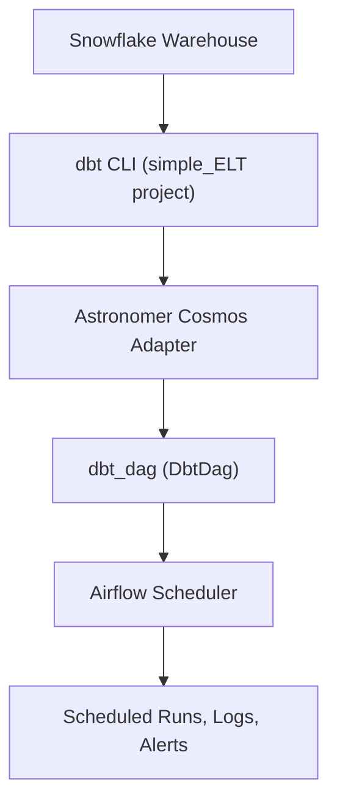

# dbt-dag

This repository bundles an Astronomer Airflow project that orchestrates a dbt ELT pipeline targeting Snowflake. The primary DAG in `dags/dbt_dag.py` uses the `DbtDag` helper from `astronomer-cosmos` to translate dbt commands into Airflow tasks that can be scheduled, monitored, and retried like native operators.

The solution relies on Astronomer Runtime 3.1 as the base image while installing `dbt-snowflake` in a dedicated virtual environment defined in the `Dockerfile`. Python dependencies in `requirements.txt` add `astronomer-cosmos` and the Snowflake provider so the Airflow connection `snowflake_conn` can supply credentials to Cosmos' `SnowflakeUserPasswordProfileMapping`.

Project assets are organized around the Airflow DAGs and the embedded dbt project. The DAG code sits in the `dags` directory, and the `dags/dbt/simple_ELT` directory contains the dbt models, macros, seeds, and tests that drive the ELT workflow. Supporting configuration such as `packages.yml`, `package-lock.yml`, and `dbt_project.yml` live alongside the dbt code, following standard dbt conventions.

## Data Flow



To run the pipeline locally, install the Astronomer CLI and start the stack:

```bash
astro dev start
```

Provide Snowflake credentials for the `snowflake_conn` Airflow connection, then trigger the `dbt_dag` from the Airflow UI or schedule; it will execute the dbt project against the configured database by invoking the dbt executable packaged in the runtime image.
